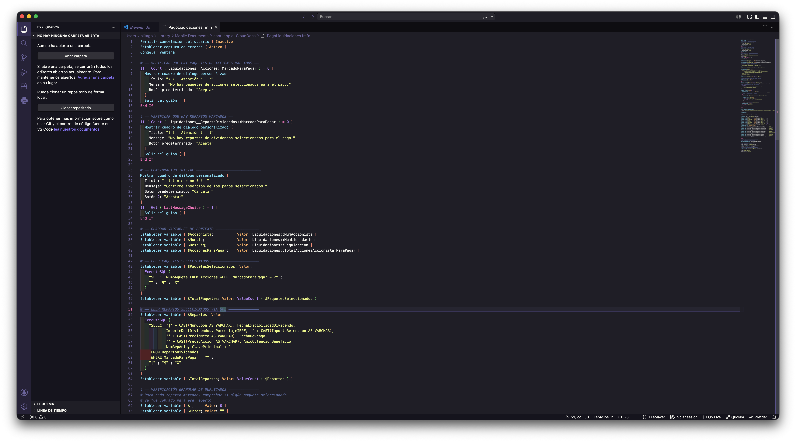

# FileMaker VSCode

> Syntax highlighting, autocompletado y snippets para cálculos y scripts de **FileMaker / Claris Pro** en Visual Studio Code.
> Actualizado hasta **FileMaker 2025 (v22)** — incluyendo funciones de IA, embeddings y RAG.

[](https://marketplace.visualstudio.com/items?itemName=alitfal.filemaker-vscode-updated)
[](https://marketplace.visualstudio.com/items?itemName=alitfal.filemaker-vscode-updated)
[](LICENSE.md)

---



---

## ✨ Características

### 🎨 Syntax Highlighting por categorías
Colores diferenciados para cada tipo de elemento:

| Elemento | Color |
|----------|-------|
| Funciones builtin | 🟣 Lila |
| Funciones AI / Embeddings | 🩷 Rosa bold |
| Funciones JSON | 🔵 Cian bold |
| Funciones criptografía | 🟠 Naranja bold |
| Funciones fecha / hora | 🟢 Verde |
| Funciones aggregate | 🟡 Amarillo bold |
| Variables locales `$var` | 🟡 Amarillo |
| Variables globales `$$var` | 🟠 Naranja bold |
| Control de flujo `If` / `End If` / `Loop` | 🩷 Rosa bold |
| Script steps | 🔵 Cian |
| Strings | 🟡 Amarillo |
| Comentarios `#` y `//` | ⚫ Gris itálica |

### 📦 354+ Snippets
Autocompletado para todas las funciones integradas de FileMaker hasta la versión 2025, con tab stops nombrados para navegar entre parámetros.

Snippets de productividad incluidos:

| Prefijo | Expansión |
|---------|-----------|
| `sqls` | ExecuteSQL con plantilla SELECT |
| `letm` | Let con múltiples variables |
| `ifi` | If inline |
| `whilet` | While con los 4 parámetros |
| `casei` | Case inline |
| `JSONSetElement multi` | JSONSetElement con múltiples pares |
| `JSONGetElement nested` | JSONGetElement con dot-notation |
| `Substitute list` | Substitute con múltiples pares |

### 🔧 JSON → JSONSetElement()
Selecciona cualquier JSON y ejecuta **FileMaker: JSON to JSONSetElement()** desde el Command Palette (`Cmd+Shift+P`) para convertirlo instantáneamente a una expresión FileMaker.

---

## 📥 Instalación

**Desde el Marketplace** — busca `FileMaker VSCode` en la pestaña Extensions de VS Code e instala.

**Manual** — descarga el `.vsix` desde [Releases](https://github.com/alitfal/filemaker-vscode/releases) y ejecuta:
code --install-extension filemaker-vscode-updated-x.x.x.vsix

---

## 🎨 Configurar colores (Dracula Pro)

Para obtener los colores que se ven en la captura, añade esto a tu `settings.json` de VS Code (`Cmd+Shift+P` → `Open User Settings JSON`):

```json
"editor.tokenColorCustomizations": {
  "[Dracula Pro]": {
    "textMateRules": [
      { "scope": "support.function.builtin_functions.filemaker", "settings": { "foreground": "#BD93F9" } },
      { "scope": "support.function.ai.filemaker", "settings": { "foreground": "#FF79C6", "fontStyle": "bold" } },
      { "scope": "support.function.json.filemaker", "settings": { "foreground": "#8BE9FD", "fontStyle": "bold" } },
      { "scope": "support.function.crypto.filemaker", "settings": { "foreground": "#FFB86C", "fontStyle": "bold" } },
      { "scope": "support.function.datetime.filemaker", "settings": { "foreground": "#50FA7B" } },
      { "scope": "support.function.aggregate.filemaker", "settings": { "foreground": "#F1FA8C", "fontStyle": "bold" } },
      { "scope": "keyword.control.filemaker", "settings": { "foreground": "#FF79C6", "fontStyle": "bold" } },
      { "scope": "keyword.other.scriptStep.filemaker", "settings": { "foreground": "#8BE9FD" } },
      { "scope": "keyword.other.scriptParam.filemaker", "settings": { "foreground": "#FFB86C" } },
      { "scope": "variable.script_variable.local.filemaker", "settings": { "foreground": "#F1FA8C" } },
      { "scope": "variable.script_variable.global.filemaker", "settings": { "foreground": "#FFB86C", "fontStyle": "bold" } },
      { "scope": "constant.numeric.filemaker", "settings": { "foreground": "#BD93F9" } },
      { "scope": "string.quoted.double.filemaker", "settings": { "foreground": "#F1FA8C" } },
      { "scope": "comment.line.hash.filemaker", "settings": { "foreground": "#6272A4", "fontStyle": "italic" } },
      { "scope": "comment.line.double-slash.filemaker", "settings": { "foreground": "#6272A4", "fontStyle": "italic" } },
      { "scope": ["keyword.operator.arithmetic.filemaker","keyword.operator.comparison.filemaker","keyword.operator.logical.filemaker","keyword.operator.string.filemaker"], "settings": { "foreground": "#FF79C6" } }
    ]
  }
}
```

---

## 📁 Extensiones de archivo soportadas

| Extensión | Uso |
|-----------|-----|
| `.fmfn` | Custom function |
| `.fmcalc` | Cálculo FileMaker |
| `.fmscript` | Script step calculation |
| `.calc` | Cálculo genérico |

Para archivos `.txt` o cualquier otro formato, selecciona el lenguaje manualmente en la barra inferior de VS Code → `Plain Text` → `FileMaker`.

---

## 🆕 Novedades v2.0.x

### Funciones nuevas FM 2023 → 2025

| Función | Categoría | Versión |
|---------|-----------|---------|
| `JSONMakeArray` | JSON | FM 2024+ |
| `JSONParse` / `JSONParsedState` | JSON | FM 2025+ |
| `GetFieldsOnLayout` | AI | FM 2025+ |
| `GetTextFromPDF` | Container | FM 2025+ |
| `GetRecordIDsFromFoundSet` | Misc | FM 2025+ |
| `GetLiveTextAsJSON` | Container | FM 2024+ |
| `AddEmbeddings` | AI | FM 2024+ |
| `CosineSimilarity` | AI | FM 2024+ |
| `GetEmbedding` / `GetEmbeddingAsFile` / `GetEmbeddingAsText` | AI | FM 2024+ |
| `GetRAGSpaceInfo` | AI | FM 2025+ |
| `GetTableDDL` | AI | FM 2025+ |
| `GetTokenCount` | AI | FM 2024+ |
| `NormalizeEmbedding` / `SubtractEmbeddings` | AI | FM 2024+ |
| `PredictFromModel` | AI | FM 2024+ |
| `Get(AIAccountName)` / `Get(AIModelName)` | Get | FM 2024+ |
| `CryptGeneratePassKey` | Crypto | FM 2023+ |

Ver [CHANGELOG](CHANGELOG.md) completo.

---

## 🤝 Contribuir

Pull requests bienvenidos. Ver [CONTRIBUTING.md](CONTRIBUTING.md) para instrucciones detalladas.

---

## 📄 Créditos

Sintaxis original de [Donovan Chandler](https://github.com/DonovanChan/Filemaker.tmbundle).
Fork original de [jwillinghalpern](https://github.com/jwillinghalpern/filemaker-vscode-bundle).
